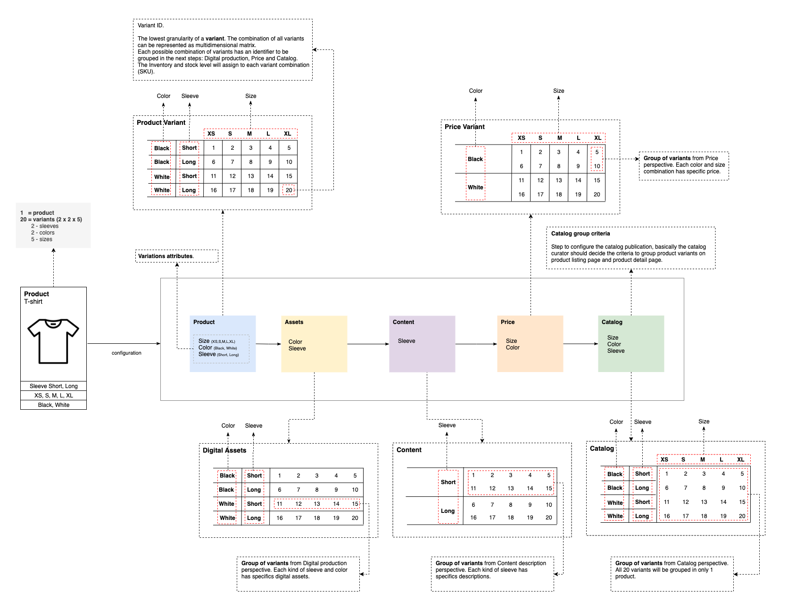

# PIM

Product Information Management (PIM) - Supports an unlimited number of variations for the same product

A product is a single item in an e-commerce catalog. Products are not necessarily physical items, they can also be digital or a service. A product is defined by a combination of property definitions.

Products with variants are products that have similarities, they are based on the same model but differ in some aspects from one another. As an e-commerce platform, we offer customers various purchase options for a product such as different colors, sizes, dimensions, flavors, materials, etc. For example:

* T-shirts available in different colors and sizes;
* Smartphones varying in color, screen size and internal memory size;
* Food and beverage with different flavors and sizes.
* Electric cars with different colors, number of doors, number of seats, battery autonomy and engine power.   
* A product variant is a specific item that is grouped with related variants that together form a product. Variants usually vary from each other in one or more properties/attributes. 

Let's see some benefits of product variants:

* Customers expect an easy-to-navigate, organized store. Product Variants make it easier for customers to navigate your store by combining products with multiple options and choices.
* Variety broadens product appeal. If the product comes with multiple options, customers can get exactly what they want and feel more satisfied with their purchase.
* Customers get personalized purchases. Offering a combination of product options means customers interact more with the product before they purchase.
* Variants are useful for organizing the inventory when we have products that vary in different ways.
* Better SEO ranking. The product weight of all variants will be aggregated in one single page, helping the products (with all possible variants) showing first on a search engine. 
* Better catalog ranking. In that case, we don't have the same product with different weights on our PLP and release space to show other products.
* Reduce product data replication and increase data consistency.
* Flexibility to create specific assets, content, attributes, and prices for the same product. 
* Accommodate new business and new kinds of products with low impact and effort.

Let's take a well-known example of products with variants that are T-shirts. A T-shirt model is available in 2 colors (white, black), 5 different sizes (XS, S, M, L, XL) and 2 different sleeve length (Short, Long).

* For all the colors and sizes of the T-shirt, some attributes are common, such as the name Cotton T-shirt with a rounded neck, category, brand, and care instructions machine wash at forty-five degrees.
* Each T-shirt color has different pictures and could have a different composition.
* Each T-shirt sleeve length could have a different description.
* Each T-shirt color could be available in different sizes: XS, S, M, L or XL.
* For each color/size, the identifier of the product is different (EAN/GTIN, SKU) as well as the technical specs like weight, sleeves length that could vary from a T-shirt from another.

## Concept design

The concept design was based on a simple idea, product variants are combined in a multidimensional matrix, where each axis/dimension is a product attribute variation with possible values for that specific product; so, the combination of each matrix element is a variant. The multidimensional variant matrix is very flexible because it's working at the lowest granularity of a product variation and also can be grouped by other information domains as they needed.

